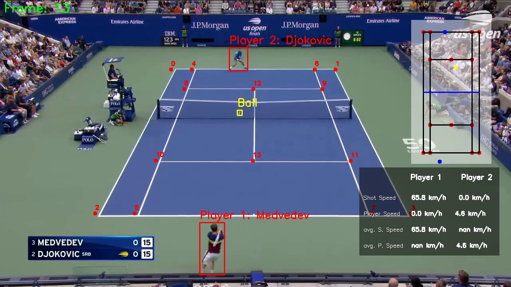

# Tennis Match Analysis with Computer Vision

## Overview

This repository contains the codebase for a comprehensive computer vision project designed for analyzing tennis matches. Leveraging advanced techniques and models, the system offers multi-faceted insights into gameplay dynamics, player movements, and ball trajectories.

## Key Features

- **YOLOv8 Player Detection:** Utilizes YOLOv8 for robust player detection within tennis match footage, enabling precise tracking of player movements throughout the match.
  
- **Fine-Tuning for Ball Detection:** Fine-tunes YOLO model to accurately detect the tennis ball in varying conditions, ensuring consistent tracking and analysis of ball trajectories.
  
- **Speed Detection:** Implements algorithms to calculate the speed of both players and the ball, providing valuable metrics for performance evaluation and tactical analysis.
  
- **Mini Court Generation:** Dynamically generates a miniature representation of the tennis court, reflecting the actual positions and movements of players during the match for intuitive visualization.
  
- **Key Point Extraction:** Fine-tunes the last layer of ResNet50 on a custom dataset to extract keypoints on the court, facilitating advanced spatial analysis and strategic insights.